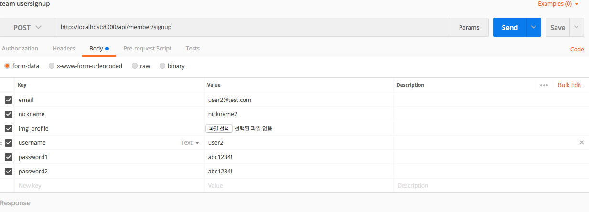
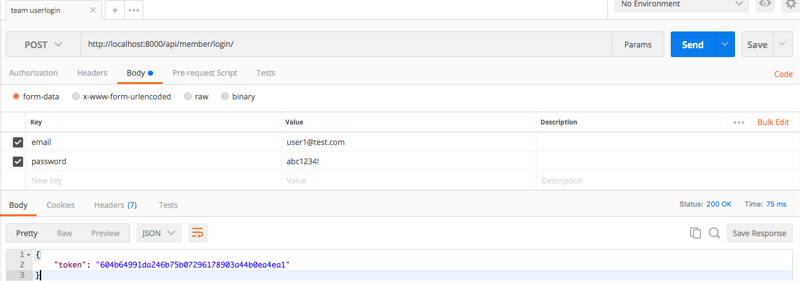
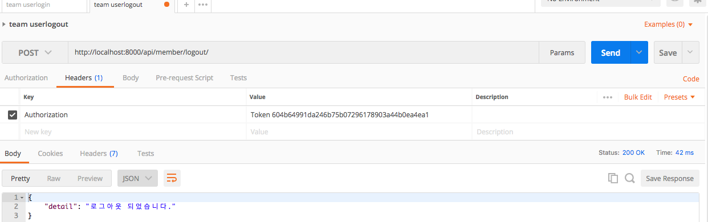
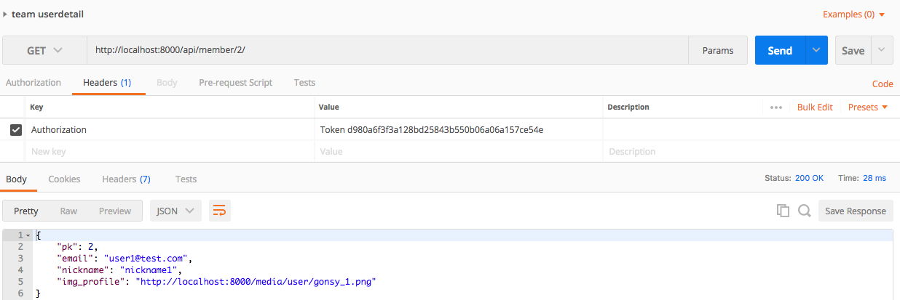
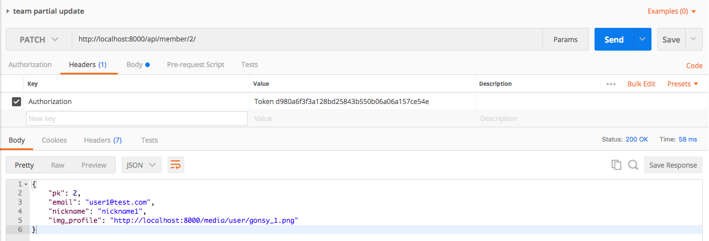
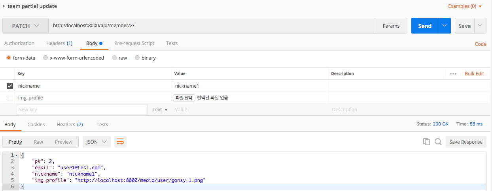
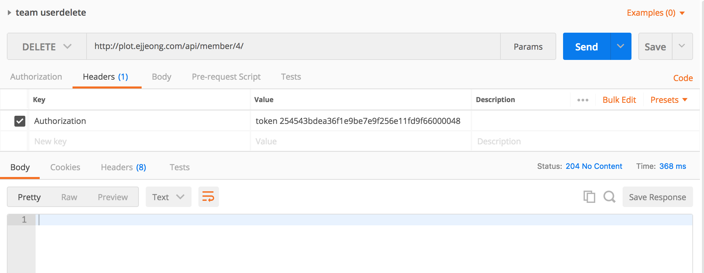

[API Address] http://plot.ejjeong.com/

### 1. user_signup ([api addr]api/member/signup)

 - post
		```
		email:
		nickname:
		img_profile:
		username:
		password1:
		password2:
		```
 - 위의 내용을 입력받아 생성

### 2. login ([api addr]api/member/login)

 - post
 - body 입력
 - email / password
 - 토큰 반환
 ```
{
    "token": "e9e06663ea93286516e8a4c2d77e07184f96a685"
}
```

### 3. logout ([api addr]api/member/logout)

 - post
 - headers에 입력
 - 로그인 한 토큰값을 사용
 - 성공하면 
 ```
 {
    "detail": "로그아웃 되었습니다."
}
```

### 4. user_detail ([api addr]api/member/(pk)/)

 - get
 - 주소 맨 끝에는 유저의 PK를 입력
 - headers에 입력
 - 유자가 로그인한 토큰값으로 접근 가능
 - 200 return

### 5. user_update ([api addr]api/member/(pk)/)


 - patch
 - headers에 자격증명 토큰 값 입력
 - body에 변경하고자할 것을 선택하고 변경

### 6. user_delete ([api addr]api/member/(pk)/)

 - delete
 - headers에 자격증명 토큰 값 입력
 - status 204 no content 반환